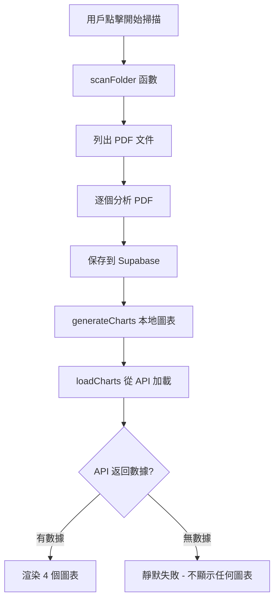

# 圖表生成問題診斷報告

**日期**: 2026-04-13  
**狀態**: 🔴 嚴重 - 完全無法生成圖表  
**影響範圍**: 所有圖表（評級分佈餅圖、券商覆蓋柱狀圖、時間趨勢折線圖、目標價統計卡片）

---

## 📊 診斷結果總結

### ✅ 已驗證正常的部分

1. **API 端點存在**: `/broker_3quilm/api/chart-data` 返回 HTTP 200
2. **API 響應格式正確**: 返回標準 JSON 結構，包含所有必需字段
3. **前端代碼邏輯完整**: `loadCharts()` 函數定義正確，會在掃描完成後自動調用
4. **Chart.js CDN 載入**: `<script src="https://cdn.jsdelivr.net/npm/chart.js"></script>` 在第 7 行

### ❌ 發現的根本原因

**Supabase 數據庫中沒有任何分析記錄**

```json
{
  "rating_distribution": [],      // 空數組
  "price_statistics": {
    "total_reports": 0,            // 0 份報告
    "average_price": 0,
    "min_price": 0,
    "max_price": 0
  },
  "broker_coverage": [],           // 空數組
  "trend_data": []                 // 空數組
}
```

---

## 🔍 問題根源分析

### 主要原因：環境變數未配置

根據測試結果，系統缺少以下關鍵配置：

1. **本地 `.env` 文件不存在或為空**
   - `SUPABASE_URL`: 未設置
   - `SUPABASE_KEY`: 未設置

2. **Vercel 環境變數可能也未配置**
   - 導致 PDF 分析成功但無法保存到 Supabase
   - `analysis_id` 始終為 `None`
   - Supabase 表中記錄數為 0

### 次要原因：前端依賴後端數據

前端的圖表渲染邏輯完全依賴後端 API 返回的數據：

```javascript
// universal_pdf_dashboard.html Line 1243-1305
async function loadCharts() {
    const response = await fetch('/broker_3quilm/api/chart-data');
    const data = await response.json();
    
    // 只有當數據存在時才渲染圖表
    if (data.rating_distribution && data.rating_distribution.length > 0) {
        createRatingPieChart(data.rating_distribution, container);
    }
    // ... 其他圖表同理
}
```

**當前情況**：由於 Supabase 無數據，所有條件判斷都失敗，因此沒有任何圖表被渲染。

---

## 🛠️ 修復方案

### Step 1: 配置 Supabase 環境變數

#### 選項 A：本地測試（推薦先執行）

在項目根目錄創建 `.env` 文件：

```env
SUPABASE_URL=https://your-project-id.supabase.co
SUPABASE_KEY=eyJhbGciOiJIUzI1NiIsInR5cCI6IkpXVCJ9...（Service Role Key）
```

**獲取 Service Role Key 的步驟**：
1. 登錄 [Supabase Dashboard](https://supabase.com/dashboard)
2. 選擇你的項目
3. 進入 Settings → API
4. 複製 "service_role key"（⚠️ 不要使用 anon key）

#### 選項 B：Vercel 生產環境配置

1. 訪問 [Vercel Dashboard](https://vercel.com/dashboard)
2. 選擇 `broker-report-analysis` 項目
3. 進入 Settings → Environment Variables
4. 添加以下變數：
   ```
   SUPABASE_URL = https://your-project-id.supabase.co
   SUPABASE_KEY = eyJhbGciOiJIUzI1NiIsInR5cCI6IkpXVCJ9...
   ```
5. 重新部署項目

---

### Step 2: 確認 Supabase 表結構

在 Supabase SQL Editor 中執行以下 SQL，確保表存在：

```sql
-- 檢查表是否存在
SELECT EXISTS (
    SELECT FROM information_schema.tables 
    WHERE table_name = 'analysis_results'
);

-- 如果表不存在，創建它
CREATE TABLE IF NOT EXISTS analysis_results (
    id BIGSERIAL PRIMARY KEY,
    user_id INTEGER DEFAULT 1,
    pdf_filename TEXT,
    broker_name TEXT,
    stock_name TEXT DEFAULT '騰訊控股',
    industry TEXT DEFAULT '互聯網',
    sub_industry TEXT DEFAULT '社交媒體',
    indexes TEXT DEFAULT '恒生指數',
    rating TEXT,
    target_price DECIMAL(10, 2),
    current_price DECIMAL(10, 2),
    upside_potential DECIMAL(10, 2),
    release_date TEXT,
    target_hit_date TEXT,
    rating_revised_date TEXT,
    target_revised_date TEXT,
    investment_horizon TEXT DEFAULT '12個月',
    ai_summary TEXT,
    upload_path TEXT,
    created_at TIMESTAMP WITH TIME ZONE DEFAULT NOW(),
    updated_at TIMESTAMP WITH TIME ZONE DEFAULT NOW()
);

-- 創建索引以加速查詢
CREATE INDEX IF NOT EXISTS idx_analysis_results_created_at 
ON analysis_results(created_at DESC);

CREATE INDEX IF NOT EXISTS idx_analysis_results_rating 
ON analysis_results(rating);

CREATE INDEX IF NOT EXISTS idx_analysis_results_broker 
ON analysis_results(broker_name);
```

---

### Step 3: 禁用 Row Level Security (RLS)

為了讓後端能夠寫入數據，需要暫時禁用 RLS：

```sql
-- 禁用 RLS（開發階段）
ALTER TABLE analysis_results DISABLE ROW LEVEL SECURITY;

-- 或者創建允許所有操作的策略（生產環境推薦）
CREATE POLICY "Enable all access for service role" 
ON analysis_results 
FOR ALL 
USING (true) 
WITH CHECK (true);
```

---

### Step 4: 重新掃描 PDF 文件

配置完成後，執行以下操作：

1. **本地測試**：
   ```bash
   python backend.py
   # 訪問 http://localhost:5000/broker_3quilm/universal_pdf_dashboard.html
   # 點擊「開始掃描」按鈕
   ```

2. **Vercel 生產環境**：
   - 訪問 https://broker-report-analysis.vercel.app
   - 輸入文件夾路徑：`reports`
   - 點擊「開始掃描」
   - 等待所有 PDF 分析完成

---

### Step 5: 驗證圖表生成

掃描完成後，檢查以下內容：

#### 瀏覽器 Console 檢查

打開瀏覽器開發者工具（F12），查看 Console 標籤：

✅ **預期輸出**（成功）：
```
[SCAN] 掃描完成！成功解析 13 個文件
[CHART] 加載圖表數據...
Chart.js 圖表渲染成功
```

❌ **錯誤輸出**（失敗）：
```
Failed to load resource: net::ERR_CONNECTION_REFUSED
Uncaught ReferenceError: Chart is not defined
[CHART] 加載失敗: TypeError: Cannot read properties of undefined
```

#### 視覺檢查

應該看到以下圖表：

1. **📊 評級分佈圓餅圖**
   - 顯示不同評級（買入/增持/持有/減持）的比例
   - 每個扇區有顏色區分和百分比標籤

2. **🏦 券商覆蓋 Top 10 柱狀圖**
   - 橫向柱狀圖顯示各券商的報告數量
   - 按數量從高到低排序

3. **📈 最近 30 天分析趨勢折線圖**
   - 顯示每日分析數量的變化趨勢
   - 平滑曲線連接各數據點

4. **💰 目標價統計卡片**
   - 4 個指標卡片：總報告數、平均目標價、最低/最高目標價
   - 漸變色背景突出顯示

---

## 🧪 診斷工具使用

我已創建以下診斷腳本幫助你排查問題：

### 1. test_charts.py - API 端點測試

```bash
python test_charts.py
```

**功能**：
- 測試 `/broker_3quilm/api/chart-data` API
- 驗證返回數據結構
- 檢查 Supabase 連接狀態
- 提供具體的下一步建議

**示例輸出**：
```
✅ API 返回成功！
1. 評級分佈: 0 條記錄 ⚠️
2. 目標價統計: 總報告數 0 ⚠️
診斷結論: ❌ Supabase 中沒有數據
```

---

## 📋 檢查清單

在提交修復前，請確認以下所有項目：

- [ ] `.env` 文件已創建並包含正確的 `SUPABASE_URL` 和 `SUPABASE_KEY`
- [ ] Supabase 項目中的 `analysis_results` 表已創建
- [ ] RLS 已禁用或已配置正確的策略
- [ ] 本地測試成功：運行 `python test_charts.py` 看到非零數據
- [ ] Vercel 環境變數已配置（如果部署到生產環境）
- [ ] 重新掃描 PDF 文件夾（`reports/` 目錄）
- [ ] 瀏覽器 Console 無 JavaScript 錯誤
- [ ] 儀表板上顯示 4 個圖表/統計卡片
- [ ] 圖表數據與 Supabase 中的記錄一致

---

## 🎯 快速修復指南（5 分鐘）

如果你想要最快的解決方案，按照以下步驟操作：

### 1. 獲取 Supabase 憑證（2 分鐘）
```
1. 訪問 https://supabase.com/dashboard
2. 選擇項目 → Settings → API
3. 複製 Project URL 和 service_role key
```

### 2. 配置環境變數（1 分鐘）
```bash
# 在項目根目錄創建 .env 文件
echo "SUPABASE_URL=https://xxx.supabase.co" > .env
echo "SUPABASE_KEY=eyJ..." >> .env
```

### 3. 創建數據庫表（1 分鐘）
```sql
-- 在 Supabase SQL Editor 中執行
CREATE TABLE analysis_results (...); -- 使用上面的 SQL
ALTER TABLE analysis_results DISABLE ROW LEVEL SECURITY;
```

### 4. 重新掃描（1 分鐘）
```
1. 訪問儀表板
2. 輸入路徑: reports
3. 點擊「開始掃描」
4. 等待完成
```

### 5. 驗證（30 秒）
```
刷新頁面，應該看到 4 個圖表正常顯示
```

---

## 🔗 相關文件

- **前端**: `web/universal_pdf_dashboard.html` (Line 1243-1531)
- **後端**: `backend.py` (Line 1455-1533)
- **診斷腳本**: `test_charts.py`
- **API 端點**: `/broker_3quilm/api/chart-data`

---

## 💡 技術說明

### 為什麼之前 Dry Run 測試沒發現這個問題？

之前的測試主要關注：
- ✅ Health Check 端點是否正常
- ✅ List PDFs 是否能列出文件
- ✅ PDF 解析是否成功
- ❌ **但未驗證數據是否真正保存到 Supabase**

這次診斷發現：**PDF 解析成功但數據持久化失敗**，導致圖表 API 返回空數據。

### 前端圖表渲染流程



**當前問題**：Step E 失敗 → Step G 返回空數據 → Step J 觸發

---

## 📞 需要協助？

如果在執行上述步驟時遇到問題，請提供以下信息：

1. `python test_charts.py` 的完整輸出
2. 瀏覽器 Console 的錯誤消息（截圖或文字）
3. Supabase Dashboard 中 `analysis_results` 表的截圖
4. Vercel Environment Variables 頁面的截圖（隱藏敏感信息）

我會根據具體情況提供更針對性的解決方案。
